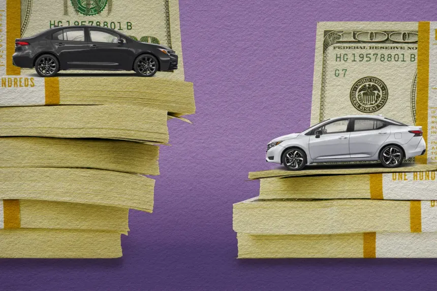

## ¿Es posible que la aseguradora me pague el dinero en lugar de reparar mi vehículo?

Sí. La aseguradora puede indemnizar **en especie** (reparando o sustituyendo tu vehículo) o **en dinero** (reconociendo el costo de la reparación). En ambos casos:

- **Plazo máximo de respuesta:** 1 mes desde la presentación del reclamo.  

 

## ¿A quién exigir la garantía sobre la reparación?

Son **solidariamente responsables**:

1. El **taller** que efectuó la reparación.  
2. La **aseguradora**, por contrato de seguro.

> **Recomendación:** Solicita directamente a tu aseguradora el cumplimiento de la garantía para agilizar el trámite.

 

## ¿El seguro continúa vigente tras la venta de mi vehículo?

No. Al vender tu vehículo:

- Se **extingue automáticamente** el seguro por pérdida del interés asegurable.  
- Debes **notificar de inmediato** a tu aseguradora para gestionar el **reembolso** de las primas no consumidas.

 

**¡contáctanos!** 
[**Agenda una consulta**](/contacto)
